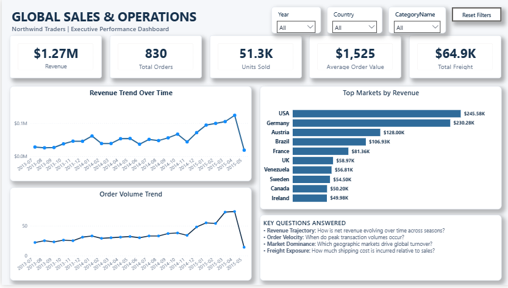

# Northwind Global Sales & Operations BI Dashboard

A Power BI business intelligence project analyzing global sales performance, product performance, logistics efficiency, regional markets and salesforce productivity for Northwind Traders.

---

## Project Overview

I built this project to explore what can be learned from a company's transactional sales and operations data when it is properly cleaned, modelled and visualized.

The objective was to create an executive-level Power BI dashboard that makes it easier to understand:

- How sales are performing over time
- Which products and categories drive revenue
- How discounts affect sales performance
- Which markets generate the most revenue
- Where freight costs are disproportionately high
- How shipping companies compare on cost, speed and reliability
- How sales employees contribute to overall revenue

The project covers the full BI workflow, from data preparation and modelling to DAX calculations, dashboard design and business analysis.

---

## Dashboard

The Power BI solution contains three main pages.

### 1. Sales & Revenue Overview

This page focuses on the overall commercial performance of the business.

Key metrics include:

- Revenue: **$1.27M**
- Orders: **830**
- Units Sold: **51,317**
- Average Order Value: **$1,525**
- Total Freight: **$64.9K**

The page also includes revenue trends, order volume trends and top-performing markets.



---

### 2. Product & Category Intelligence

This page examines product and category performance, discounts and the contribution of active and discontinued products.

Key findings include:

- Beverages and Dairy generated approximately **39.7% of total revenue**
- Côte de Blaye generated approximately **$141.4K**
- Total discounts were approximately **$88.7K**
- Overall discount rate was approximately **6.55%**
- Discontinued products represented **10.4% of the catalogue but approximately 14.6% of historical revenue**


---

### 3. Regional, Operational & People Performance

This page combines geographic performance, freight efficiency, shipping performance and employee productivity.

Key metrics include:

- Average Delivery Time: **8.49 days**
- On-Time Rate: **95.43%**
- Freight as % of Revenue: **5.13%**

The page also compares shipping providers and highlights the strongest sales employees by revenue.


---

## Key Business Insights

### Sales Growth

Revenue increased from approximately **$208.1K in 2013** to approximately **$617.1K in 2014**.

The monthly trend also showed recurring increases in activity toward the final quarter of the year.

### Product Concentration

Beverages and Dairy were the strongest revenue categories, while Côte de Blaye alone contributed approximately **11.2% of total company revenue**.

### Discontinued Products

Discontinued products generated approximately **$185K**, despite representing only **10.4% of the product catalogue**.

This suggests that product discontinuation decisions should consider historical demand and commercial importance.

### Discounts

Total discounts amounted to approximately **$88.7K**, with Meat & Poultry recording the highest category discount rate at approximately **8.51%**.

### Freight

Overall freight represented approximately **5.13% of revenue**, but some markets had considerably higher freight burdens.

Argentina recorded the highest freight-to-revenue ratio at approximately **7.37%**.

### Shipping

Federal Shipping recorded the strongest on-time performance at approximately **96.39%**, while Speedy Express had the lowest freight cost per order at approximately **$65.45**.

This highlights the trade-off between cost, speed and reliability.

---

## Data & Technology

### Tools

- Power BI Desktop
- Power Query
- DAX
- CSV
- Data Modelling
- Business Intelligence

### Dataset

The project uses the following Northwind tables:

- Customers
- Products
- Categories
- Orders
- Order Details
- Employees
- Shippers

The dataset contains approximately:

- 830 orders
- 2,155 order-detail records
- 77 products
- 91 customers
- 8 categories
- 9 employees
- 3 shippers

---

## Data Preparation

Before building the dashboard, I cleaned and transformed the source data using Power Query.

The preparation included:

- Standardizing data types
- Cleaning identifiers
- Formatting dates
- Creating product status classifications
- Calculating delivery days
- Creating shipping status classifications
- Validating relationships between tables

---

## Data Model

The Power BI model uses a relational structure connecting customers, orders, products, categories, employees and shippers.

A dedicated Date table was also created for time-based analysis.


---

## Key DAX Measures

Some of the main measures created for the dashboard include:

- Gross Sales
- Discount Amount
- Revenue
- Total Orders
- Units Sold
- Average Order Value
- Total Freight
- Average Freight
- Discount Rate
- Average Delivery Days
- On-Time Orders
- Late Orders
- Not Shipped Orders
- On-Time Rate
- Freight % of Revenue
- Revenue per Unit

---

## Dashboard Features

The report includes:

- Year filtering
- Country filtering
- Category filtering
- Synchronized slicers across pages
- Reset Filters button
- Interactive visual filtering
- KPI cards
- Trend analysis
- Geographic analysis
- Product analysis
- Shipping performance analysis
- Employee performance analysis

---

## Repository Contents

```text
northwind-global-sales-bi/
│
├── customers.csv
├── products.csv
├── categories.csv
├── orders.csv
├── order_details.csv
├── employees.csv
├── shippers.csv
│
├── Northwind_Global_Sales.pbix
├── Northwind_Project_Report.pdf
│
├── page-1-sales-revenue.png
├── page-2-product-category 1.png
├── page-2-product-category 2.png
├── page-3-regional-operations-people 1.png
├── page-3-regional-operations-people 2.png
├── data-model 1.png
├── data-model 2.png
│
├── README.md
└── FINDINGS.md
